# Hospital Management System 🏥

A comprehensive **desktop application** that simulates a real hospital environment. This project is a practical implementation of programming skills including **Object-Oriented Programming (OOP)**, **system design**, **database integration**, and **interface design**.

The system provides complete management of daily hospital operations, including **patients, doctors, staff, appointments, medical records, lab tests, prescriptions, billing**, and **user management** with roles and permissions.

---

## 🚀 Project Purpose

The Hospital Management System is designed to:

- Provide a **realistic simulation** of hospital workflows.
- Manage all aspects of hospital operations in a **single desktop application**.
- Apply and demonstrate **programming and design skills** including:
  - Object-Oriented Programming (OOP)
  - Layered Architecture
  - Database integration with SQL Server
  - User interface design with Windows Forms (WinForms) and Guna UI

---

## 🛠 Technologies Used

- **C#** – Main programming language.
- **.NET Framework** – Framework for building the desktop application.
- **Windows Forms (WinForms)** – For creating modern GUIs.
- **Layered Architecture** – Organizing code into Models, Data Access Layer (DAL), Business Logic Layer (BLL), Services, and Forms.
- **SQL Server Management Studio 19 (SSMS 19)** – Database management and queries.
- **ADO.NET** – For connecting the application to the database.
- **Microsoft Visual Studio 2022** – IDE used for development.
- **Guna UI Framework (Optional)** – For enhanced modern UI elements.

---

## ⚙️ Key Features / Functionalities

### Dashboard
- Quick insights with interactive **cards** for:
  - Daily statistics: appointments, patients, lab tests, invoices
  - Graphs for patient distribution, lab tests per department, yearly trends
- Latest registered patients for quick access
- News & updates section
- Help & guidance section
- Side navigation menu for easy access

*Note: Some data displayed is sample/test data.*

### User & Role Management
- Create and manage system users
- Assign **roles and permissions** for fine-grained access control

### Patient Management
- Register and update patient information
- Track appointments linked to **medical records**

### Doctor & Staff Management
- Manage doctors and staff information
- Assign tasks and responsibilities

### Appointments, Medical Records, Lab Tests & Prescriptions
- Manage **appointments, medical records, lab tests, and prescriptions**
- Activate/deactivate lab test types (restricted to authorized users)
- Workflow:
  1. Schedule patient appointment
  2. Record actual visit
  3. Create or link medical record
  4. Doctor diagnoses, orders lab tests, and prescribes
  5. Schedule follow-up if needed

### Billing & Payments
- Manage hospital invoices (paid/unpaid)
- Detailed payment history and methods
- Issue invoices linked to appointments for authorized users

### Audit / Activity Logs
- Track all system operations
- Detailed logs for transparency and accountability

### User-Friendly Interface
- Modern UI with Windows Forms and Guna UI
- Consistent navigation across all modules

---

## 🏗 System Architecture

The system uses a **Layered Architecture** to ensure modularity, maintainability, and scalability.

### 1. Data Access Layer (DAL)
- Service classes responsible for database connectivity
- Static repositories for each entity (Patients, Doctors, Appointments, etc.)
- Uses **ADO.NET** for database communication
- Can be upgraded to **Entity Framework** in the future

### 2. Models Layer
- Defines classes representing system entities (Patient, Doctor, User, Appointment)
- Stores properties and structure of objects

### 3. Interfaces Layer
- Defines **contracts** (interfaces) implemented by service classes
- Promotes loose coupling between layers

### 4. Services Layer
- Implements interface contracts
- Bridges **DAL** and **Presentation Layer**
- Contains **business logic and validation rules**

### 5. Presentation Layer (Forms)
- GUI built with **WinForms** and **Guna UI**
- Forms include Dashboard, Patient Management, Billing, etc.

### 6. Utilities Layer
- Reusable helper classes and utilities
  - Input validation
  - Security (e.g., password hashing)
  - Common operations
- Global settings accessible across the system

---

## 🗄 Database Design / Schema

The database design follows **relational best practices** to ensure flexibility, scalability, and maintainability.

### Highlights:
- **Core Person Entity** – Central table for all roles (Patient, Doctor, Staff, User)
- **Departments** – Medical and administrative departments
- **Users, Roles, Permissions** – Fine-grained hierarchical permissions
- **Appointments & Medical Records** – Link patients, doctors, and visits
- **Billing & Payments** – Detailed bill items and payment history
- **Lab Tests & Prescriptions** – Track requested tests and prescribed medications
- **Audit Logs** – Automatic tracking of all system operations via triggers
- **Performance Enhancements** – Views and Stored Procedures for faster queries

---

## 📸 Screenshots

### System Architecture Diagram

### Dashboard
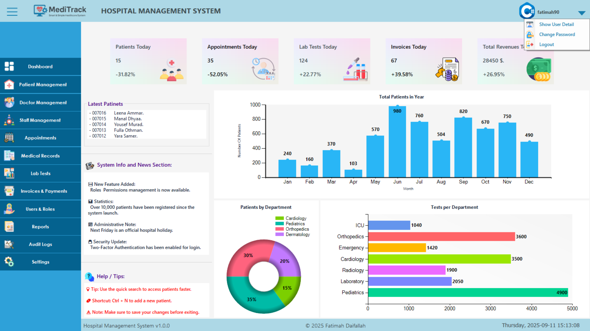

### User & Role Management
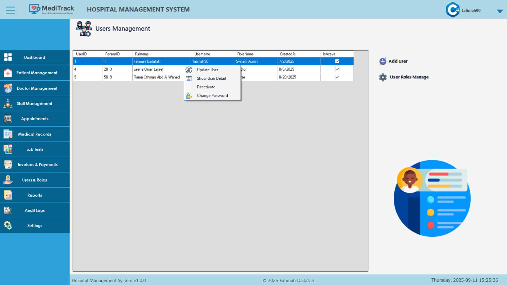

### Patient Management
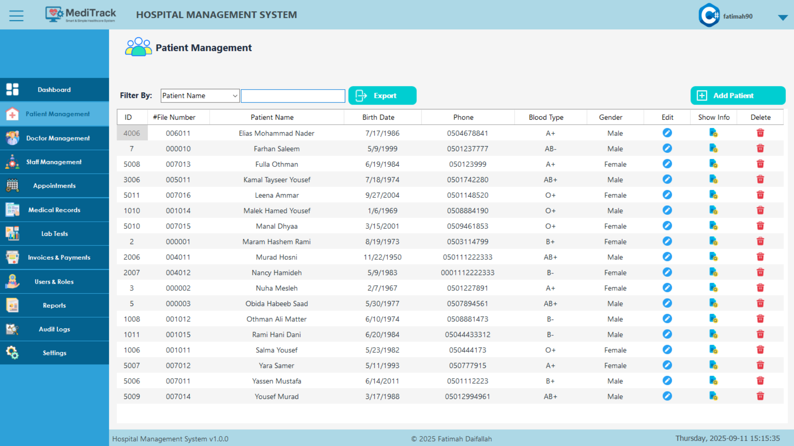
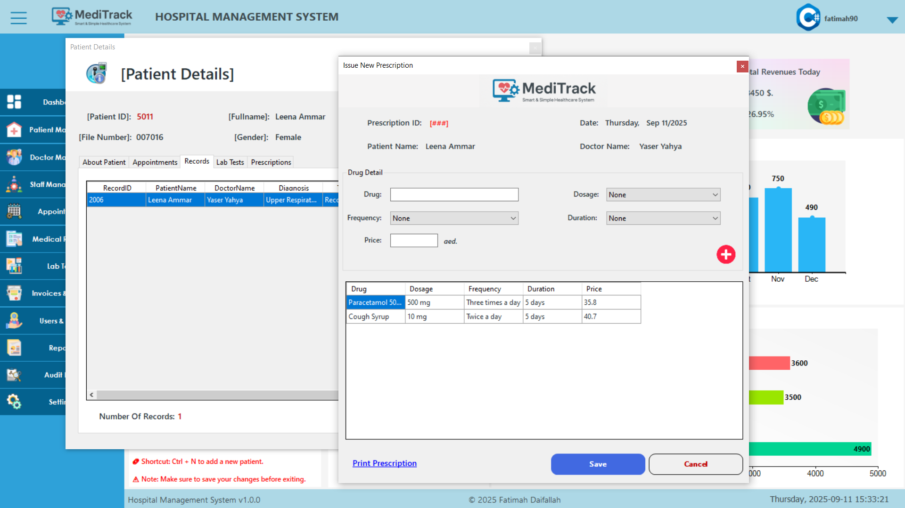

### Doctor & Staff Management
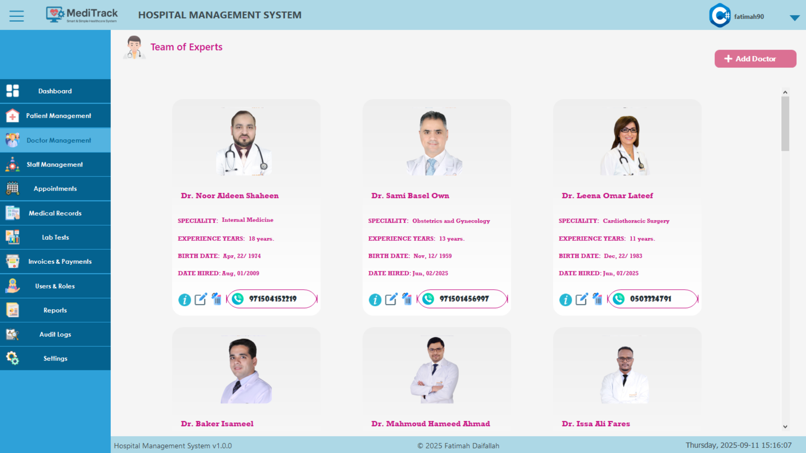
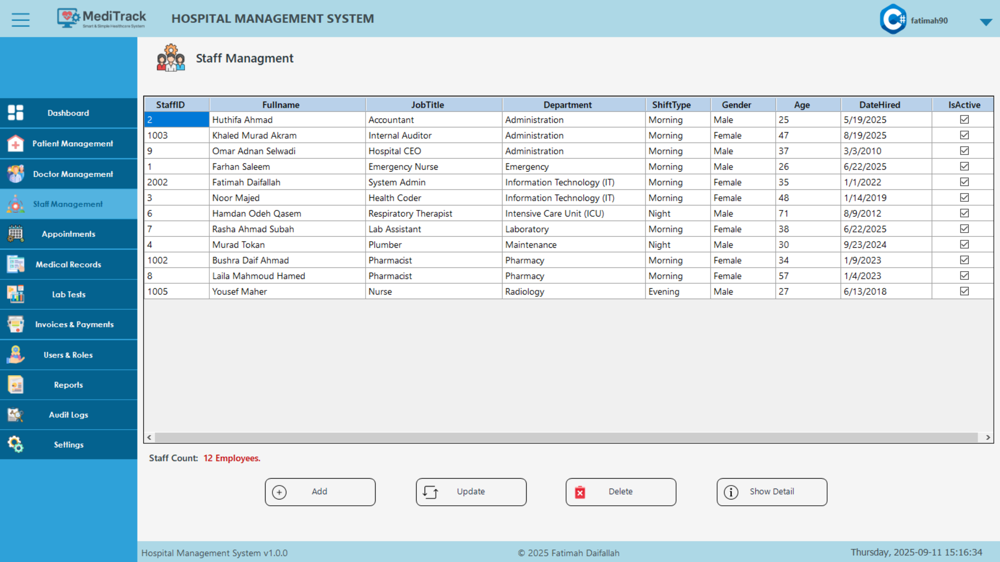

### Appointments
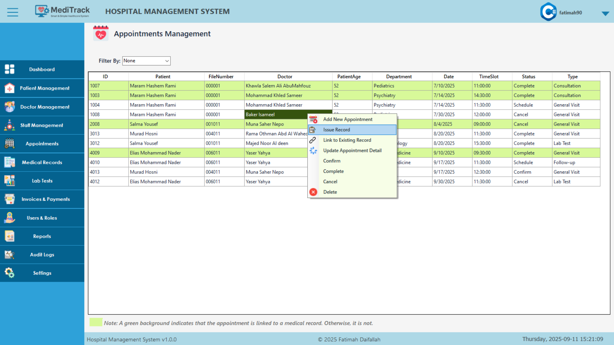

### Medical Records
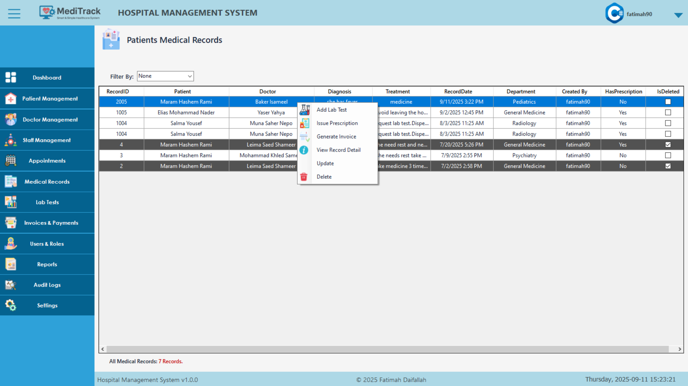

### Lab Tests
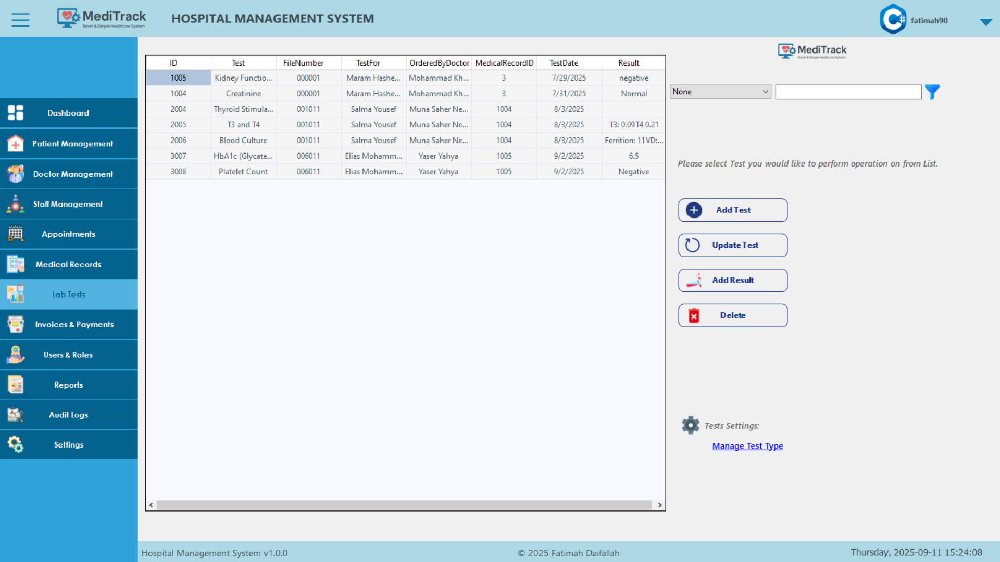

### Billing & Payments
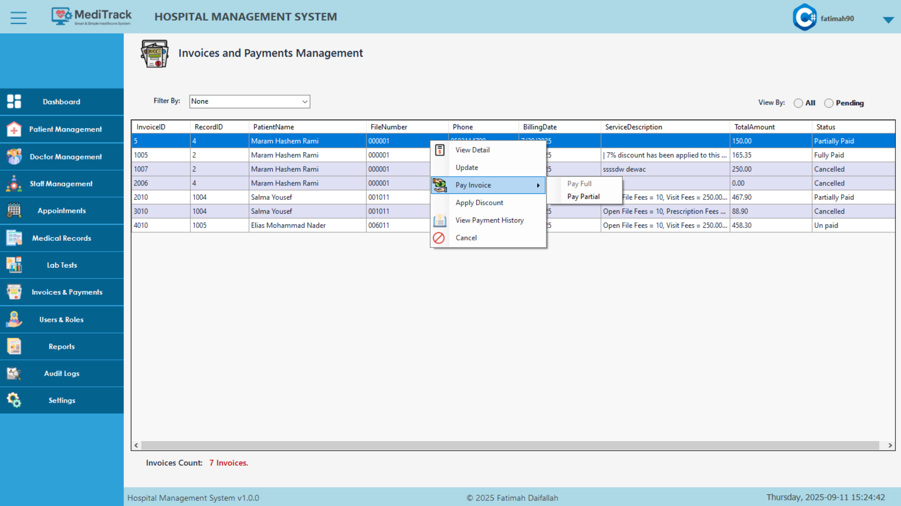

### Audit / Activity Logs
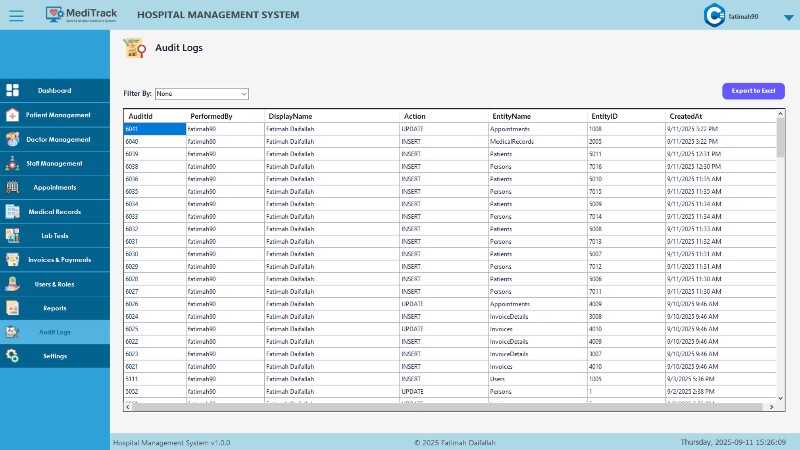

---

## 👩‍💻 Contributors / Author

**Fatimah Daifallah** – Fullstack Desktop Developer  
- Designed system architecture and layered structure
- Developed **DAL, Services, and Presentation Layers**
- Created database schema and integrated **ADO.NET**
- Implemented core functionalities:
  - Patient Management
  - Appointments & Medical Records
  - Lab Tests & Prescriptions
  - Billing & Payments

---

## 🛣 Future Improvements / Roadmap 🚀
- SMS/Email notifications for appointments and follow-ups
- Inventory Management for medications and supplies
- Integration with external systems (labs, pharmacies)
- Enhanced analytics and reporting dashboards
- Replace ADO.NET with **Entity Framework** for easier data management
- Multi-user remote database support

---

**This project is a complete demonstration of building a real-world hospital management system using modern software development practices.**
